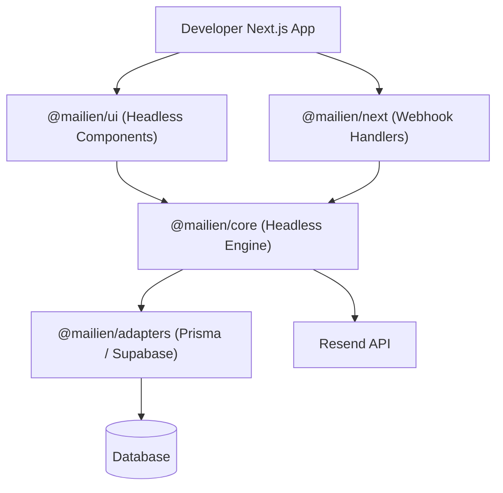

# 📧 Mailien

<p align="center">
  <strong>The open infrastructure layer for building world-class email dashboards.</strong><br />
  <em>Powered by Resend, architected for developers.</em>
</p>

<p align="center">
  
  
  
  
</p>

---

## 🏗️ What is Mailien?

Mailien is a **Composable Email Infrastructure UI Kit + Fullstack Engine**.

Resend gives you the API; Mailien gives you the **product**. It abstracts the complexity of inbound parsing, deterministic threading, state management, and database synchronization into a set of developer-first primitives.

### 🎯 Think of it as:
- **shadcn/ui** for email components.
- **NextAuth** for email infrastructure.
- **Stripe** for email dashboard logic.

---

## ⚡ Quick Start

```bash
pnpm add @mailien/core @mailien/prisma-adapter @mailien/next @mailien/ui
```

```ts
import { createMailien } from '@mailien/core'
import { prismaAdapter } from '@mailien/prisma-adapter'

const mailien = createMailien({
  apiKey: process.env.RESEND_API_KEY!,
  adapter: prismaAdapter(prisma),
})

// Send an email
await mailien.send({ to: 'user@example.com', subject: 'Hello!', html: '<h1>Hi</h1>' })

// Process a webhook
await mailien.processWebhook(payload)

// Fetch the inbox
const inbox = await mailien.getInbox(mailboxId)
```

> 📖 **[Full Getting Started Guide →](docs/GETTING_STARTED.md)**

---

## 🧬 Architecture



---

## ✨ Key Features

- **🚀 15-Minute Setup** — From `pnpm install` to a working inbox.
- **🧵 Deterministic Threading** — Native Gmail-style threading logic based on RFC 2822 headers.
- **🔌 Database Agnostic** — Swap between Prisma and Supabase, or build your own adapter.
- **🎨 Headless UI** — Premium React components for Inbox, Thread, and Composer.
- **🪝 Hook-Based API** — `useInbox()`, `useThread()`, `useComposer()` for clean state management.
- **⚡ Plugin System** — Extensible via hooks and the plugin interface.

---

## 📦 Package Ecosystem

| Package | Version | Description |
| :--- | :--- | :--- |
| [`@mailien/core`](packages/core) | `0.0.1` | Headless engine: ingestion, parsing, threading, state machine |
| [`@mailien/next`](packages/next) | `0.0.1` | Next.js App Router webhook handlers |
| [`@mailien/ui`](packages/ui) | `0.0.1` | React hooks & components (Inbox, Thread, Composer) |
| [`@mailien/prisma-adapter`](packages/adapters/prisma) | `0.0.1` | Prisma database adapter |
| [`@mailien/supabase-adapter`](packages/adapters/supabase) | `0.0.1` | Supabase database adapter with SQL schema & RLS |

---

## 📚 Documentation

| Doc | Description |
|:----|:------------|
| **[Getting Started](docs/GETTING_STARTED.md)** | Install, configure, and build your first inbox |
| **[API Reference](docs/API_REFERENCE.md)** | Complete reference for all public exports |
| **[Architecture](docs/ARCHITECTURE.md)** | How the engine handles threading and state |
| **[Data Model](docs/DATA_MODEL.md)** | Schema definitions for Prisma and SQL |
| **[API Design](docs/API_DESIGN.md)** | Core, UI, and Hook API design notes |
| **[PRD](docs/PRD.md)** | Product vision and roadmap |
| **[Fintech Plugin](docs/FINTECH_PLUGIN.md)** | Experimental Stellar-powered payments |

---

## 🛠️ Development

```bash
# Clone
git clone https://github.com/OckiyaCliff/mailien.git
cd mailien

# Install
pnpm install

# Build all packages
pnpm run build

# Run the demo
cd apps/demo
pnpm run dev
```

---

## 🛡️ License

Distributed under the MIT License. See `LICENSE` for more information.

---

<p align="center">
  Built with ❤️ for the founder community. Let's make email infrastructure fun again.
</p>