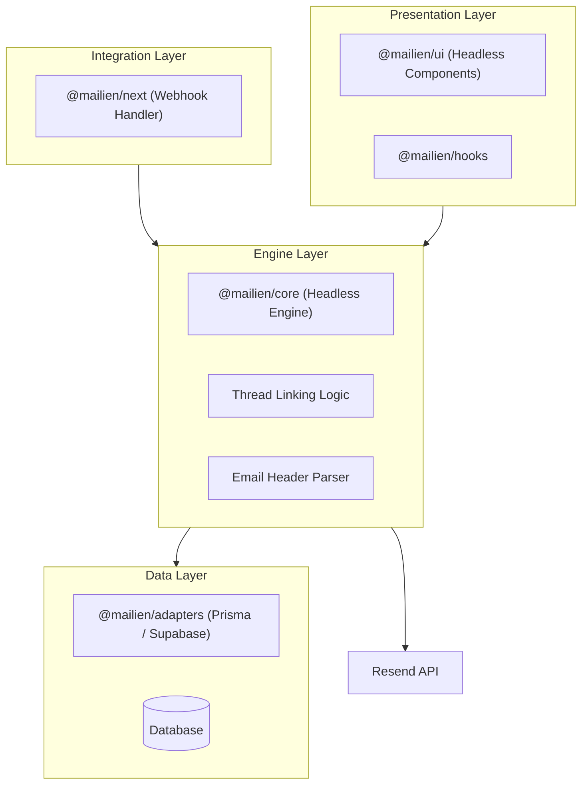
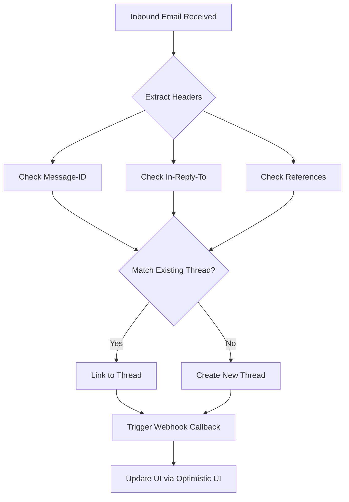

# 🏗️ MAILIEN — Technical Architecture

> **"A modular, multi-package monorepo designed for scale and developer flexibility."**

---

## 1. System Topology

Mailien follows a **Layered Headless Architecture**. We separate the presentation (React), the ingestion (Webhooks), and the core business logic (The Engine) to ensure maximum flexibility.

---

## 2. Package Monorepo Structure

Mailien is organized as a **pnpm workspace monorepo** managed with **Turborepo** for high-performance builds and cross-package coordination.

| Folder | Package | Target |
| :--- | :--- | :--- |
| `packages/core` | `@mailien/core` | Headless logic, parser, and state machine. |
| `packages/next` | `@mailien/next` | Framework-specific bindings for Next.js. |
| `packages/ui` | `@mailien/ui` | Composable React components and hooks. |
| `packages/adapters` | `@mailien/adapters` | DB persistence layers (Prisma, Supabase). |
| `plugins/stellar` | `@mailien/stellar` | Experimental financial rail integration. |

---

## 3. The Thread Engine (The "Secret Sauce")

Resend provides raw email events. Mailien provides **Conversation Context**. Our thread engine ensures every incoming email is correctly linked to its parent conversation, even when standard headers are inconsistent.

### Threading Algorithm

---

## 4. The Data Cycle

Mailien is designed to be **deterministic and idempotent**. If a webhook is triggered multiple times for the same email, the system ensures zero duplicates and total state consistency.

1.  **Ingestion**: Webhook receives payload from Resend.
2.  **Verification**: Webhook signature is verified against `@mailien/next` utility.
3.  **Parsing**: Payload is passed to `@mailien/core` to extract intent and metadata.
4.  **Threading**: The engine resolves the conversation ID.
5.  **Persistence**: The message is written to the developer's DB via the chosen **Adapter**.
6.  **Broadcast**: System triggers optional localized callbacks for custom app logic.

---

## 5. Technology Philosophy

| Layer | Technology | Choice Rationale |
| :--- | :--- | :--- |
| **Monorepo** | Turborepo + pnpm | Speed, strict dependencies, industry standard. |
| **Build** | `tsup` | Fastest way to bundle TypeScript packages. |
| **Styling** | Tailwind CSS | Unmatched developer speed and customization. |
| **Testing** | Vitest | Extremely fast, JSDOM support, Next.js friendly. |

---

> [!NOTE]
> Architecture is a living entity. As we build Phase 1, we will iterate on the internal interfaces.
