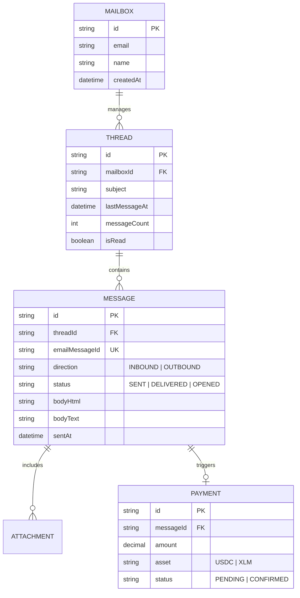

# 🗄️ MAILIEN — Data Model Specification

> **"A deterministic schema for conversation threading and message persistence."**

Mailien is database-agnostic via **Adapters**, but our internal engine depends on a specific relational structure to guarantee consistent threading.

---

## 1. Entity Relationship Diagram (ERD)



---

## 2. Model Definitions

### 🏛️ Core Mailbox
| Field | Type | Description |
| :--- | :--- | :--- |
| `id` | `cuid` | Unique identifier. |
| `email` | `string` | The technical address handled by the mailbox. |
| `name` | `string` | Human-readable label (e.g. "Sales", "Support"). |

### 🧵 Conversation Thread
| Field | Type | Description |
| :--- | :--- | :--- |
| `id` | `cuid` | The unique ID of the conversation. |
| `subject` | `string` | Extracted from the first email in the thread. |
| `lastMessageAt` | `DateTime` | Used for sorting the inbox. |
| `isRead` | `Boolean` | Tracking unread state across the thread context. |

### 📧 Message Record
| Field | Type | Description |
| :--- | :--- | :--- |
| `emailMessageId` | `string (Unique)` | The native RFC 2822 header ID. |
| `direction` | `Enum` | `INBOUND` (received) or `OUTBOUND` (sent). |
| `status` | `Enum` | `QUEUED`, `SENT`, `DELIVERED`, `OPENED`, `BOUNCED`. |

---

## 3. Reference Implementation (Prisma)

```prisma
// Example Core Model Snippet
model Thread {
  id            String    @id @default(cuid())
  mailboxId     String
  mailbox       Mailbox   @relation(fields: [mailboxId], references: [id])
  subject       String
  lastMessageAt DateTime  @default(now())
  messageCount  Int       @default(0)
  isRead        Boolean   @default(false)
  messages      Message[]
  
  @@index([mailboxId])
  @@index([lastMessageAt])
}

model Message {
  id             String           @id @default(cuid())
  threadId       String
  thread         Thread           @relation(fields: [threadId], references: [id])
  emailMessageId String           @unique
  direction      MessageDirection
  status         MessageStatus    @default(QUEUED)
  bodyHtml       String?
  bodyText       String?
  sentAt         DateTime?
  // ...
}
```

---

## 4. Performance & Scalability

> [!IMPORTANT]
> To ensure high performance in larger mailboxes, the follow indexes are mandatory:
> 1. `mailboxId` + `lastMessageAt` on **Thread** (for the inbox view).
> 2. `emailMessageId` on **Message** (for webhook lookup).
> 3. `threadId` on **Message** (for conversation view).

---

## 5. Persistence Strategy

- **Prisma**: Recommended for Next.js / Serverless environments.
- **Supabase**: Recommended for developers who want real-time features and managed Postgres.
- **Custom**: Any database can be integrated by implementing the `MailienAdapter` interface.
