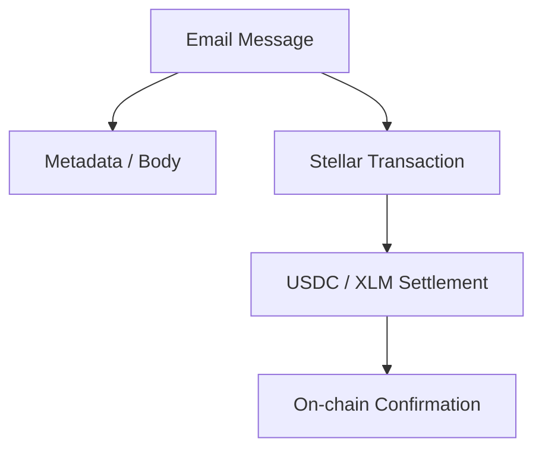

# ⚡ MAILIEN — Stellar Fintech Plugin

> **"Programmable payment actions meets deterministic email communication."**

The `@mailien/stellar` plugin is an experimental layer that transforms email into a financial rail. By treating money like a specialized "Value Attachment," we enable developers to build B2B and B2C payment workflows directly within the inbox.

---

## 1. Vision: The Payment-Aware Email

Traditional email is purely informational. In the Mailien ecosystem, email is **transactional**. Every email sent via the Stellar plugin can carry a settlement directive.



---

## 2. Core Primitives

### 💰 Money as an Attachment
Instead of a PDF or an Image, a message can contain a `PaymentInstruction`.
- **Non-custodial**: Mailien stores *instructions*, not *keys*.
- **Settlement**: Handled on the Stellar blockchain for low fees and sub-5s finality.

### 🆔 Identity Mapping
We leverage the Stellar Federation protocol to map human-readable email addresses to public keys.
`alice@company.com` ↔ `GA7Q...XYZ`

---

## 3. Developer Workflow

```ts
import { stellarPlugin } from "@mailien/stellar";

const mailien = createMailien({
  // ...
  plugins: [
    stellarPlugin({
      network: "testnet",
      walletResolver: async (email) => resolveFromDB(email)
    })
  ]
});

// Sending an email with value
await mailien.send({
  to: "freelancer@work.com",
  subject: "Design Payment",
  payment: { amount: "50.00", asset: "USDC" }
});
```

---

## 4. UI Components

| Component | UI Role |
| :--- | :--- |
| **PaymentBadge** | Renders in the inbox list to highlight messages with value. |
| **PaymentAction** | The "Pay Now" or "Confirm Receipt" button in the thread view. |
| **TxHistory** | A ledger-style view of all value transfers associated with a mailbox. |

---

## 5. Strategic Roadmap (Fintech Track)

1.  **Phase Alpha**: Basic XLM transfers and wallet resolution.
2.  **Phase Beta**: Support for regulated assets (USDC) and cross-asset payments.
3.  **Phase Gamma**: Integrated UI primitives for web and mobile.
4.  **Phase Delta**: Programmable escrow and smart-contract triggers.

---

> [!CAUTION]
> This plugin is experimental. Handling financial data requires compliance with local laws (KYC/AML). Mailien provides the rails; the developer provides the compliance engine.
