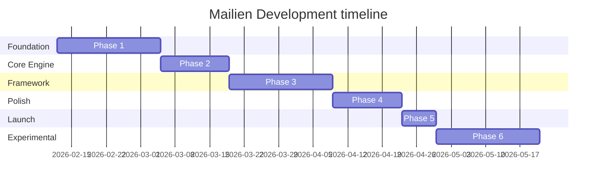

# 🗺️ MAILIEN — Implementation Plan & Roadmap

> **"A phased engineering path from conceptual proof to world-class developer tooling."**

Mailien's development is structured into 5 foundational phases plus an experimental fintech extension. Our focus is on **stability**, **deterministic behavior**, and **developer experience**.

---

## 📅 Roadmap Overview

---

## 🚀 Phase Breakdown

### Phase 1: Foundation (Weeks 1–3) ✅
- **Goal**: Prove the core threading and ingestion logic in a monolithic demo app.
- **Success Criteria**:
  - [x] Sent and received emails correctly threaded.
  - [x] Working Next.js dashboard with Resend webhooks.
  - [x] Schema migrations finalized in Prisma.

### Phase 2: Core Engine Isolation (Weeks 4–5) ✅
- **Goal**: Extract business logic into a headless package.
- **Deliverables**: `@mailien/core` and `@mailien/prisma-adapter`.
- **Constraint**: Zero framework dependencies in the core engine.

### Phase 3: Framework & UI (Weeks 6–8) ✅
- **Goal**: Package components for developer consumption.
- **Deliverables**: `@mailien/next` (Webhook Handler) and `@mailien/ui`.
- **Pattern**: shadcn-style component injection.

### Phase 4: Adapters & Documentation (Weeks 9–10) ✅
- **Goal**: Expand database support and polish docs.
- **Deliverables**: `@mailien/supabase-adapter`, API Reference, Getting Started guide.

### Phase 5: Open Source Launch (Week 11) ✅
- **Goal**: Prepare for public distribution.
- **Deliverables**: LICENSE, CONTRIBUTING.md, issue templates, `@mailien/stellar` plugin.

---

## ⚖️ Priority Matrix

| Feature | Priority | Complexity | Impact |
| :--- | :---: | :---: | :---: |
| **Ingestion Engine** | 🔴 P0 | Medium | High |
| **Threading Algorithm** | 🔴 P0 | High | Very High |
| **Prisma Adapter** | 🔴 P0 | Medium | High |
| **Next.js Webhook Wrapper** | 🟡 P1 | Low | High |
| **UI Primitive Library** | 🟡 P1 | Medium | High |
| **CLI Tool (Installer)** | 🟢 P2 | Low | Medium |
| **Stellar Plugin (Fintech)** | ⚪ Exp | High | Disruptive |

---

## ⚠️ Risk & Mitigation

| Risk | Impact | Mitigation Plan |
| :--- | :---: | :--- |
| **Inconsistent Headers** | High | Subject-matching and custom fingerprinting fallback. |
| **Webhook Latency** | Medium | Background queueing and optimistic UI updates. |
| **Persistence Lock-in** | Medium | Strict adherence to the `MailienAdapter` interface. |
| **Regulatory Risk (Stellar)**| High | Non-custodial only; developer carries compliance weight. |

---

## 🛠️ Technical Decisions

| Decision | Selection | Rationale |
| :--- | :--- | :--- |
| **Language** | TypeScript | Type safety for complex threading logic. |
| **Monorepo** | Turborepo | Parallel build tasks and local caching. |
| **Bundler** | tsup | Modern ESBuild wrapper with zero-config for libs. |
| **Persistence** | Adapter Pattern | Maximum scalability across different DB stacks. |
