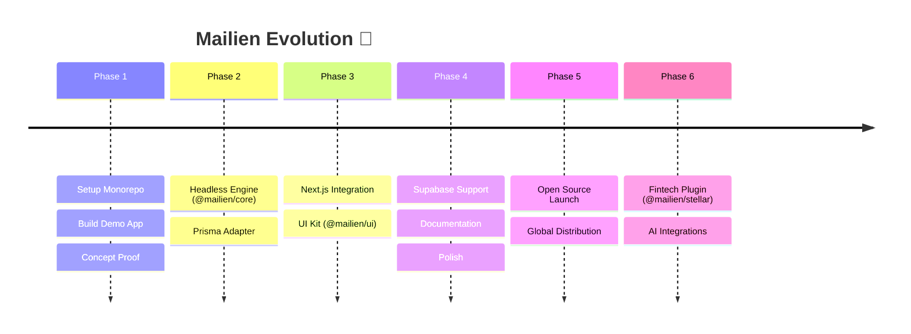

# 📄 MAILIEN — Product Requirements Document (PRD)

> **"Build production-ready email systems in minutes, powered by Resend."**

| Metadata | Details |
| :--- | :--- |
| **Version** | 1.1 |
| **Date** | February 12, 2026 |
| **Status** | Strategic Roadmap |
| **License** | MIT |

---

## 1. Executive Summary

Mailien is the **open infrastructure layer** for building custom email dashboards. While providers like Resend have revolutionized *sending* and *receiving* emails via API, developers are still left with the monumental task of building the **system**—threading, analytics, storage, and UI.

Mailien bridges this gap by providing a headless engine and a modular UI kit that transforms Resend into a full-scale email product out of the box.

---

## 2. Core Pillars

> [!TIP]
> Our goal is to reduce "Time to First Inbox" (TTFI) to under 15 minutes.

1.  **Productized API** — We don't just wrap Resend; we turn its events into a structured product data model.
2.  **Deterministic Threading** — Native, reliable conversation grouping that "just works."
3.  **Modern DX** — Headless logic with shadcn-inspired component delivery.
4.  **Extensibility** — Plugin architecture for things like Stellar-powered blockchain payments.

---

## 3. Market Opportunity

The "Build vs. Buy" struggle for email dashoards is real.
- **Buy**: Expensive, rigid, and often bloated SaaS (e.g., Front, Intercom).
- **Build**: Months of engineering effort spent on redundant infrastructure (webhooks, threading logic, storage).

**Mailien is the middle path: Pre-built infrastructure with total developer control.**

---

## 4. Product Definition

### ✅ V1 Scope (The Core Engine)

We focus on the **atomic units** of dynamic email:

| Feature | Description |
| :--- | :--- |
| **Unified Sending** | A clean API to send via Resend with auto-threading. |
| **Ingestion Engine** | Framework-ready webhook handlers for incoming mail. |
| **Conversation Logic** | Grouping messages by `Message-ID`, `In-Reply-To`, and `References`. |
| **Persistence** | Official adapters for Prisma (Postgres/MySQL) and Supabase. |
| **UI Primitives** | Inbox, Thread View, Composer, and Sidebar components. |

### ❌ Excluded from V1 (Expansion Targets)

- Full-text search (Planned for V2)
- AI-assisted replies (Planned for V5)
- Native team management (Planned for V3)
- Multi-tenancy (Enterprise layer)

---

## 5. Strategic Roadmap

---

## 6. Success Metrics

| Goal | Metric |
| :--- | :--- |
| **Adoption** | 1,000+ GitHub Stars within 6 months. |
| **Usage** | 100+ production apps utilizing the engine. |
| **Community** | 10+ active contributors to adapters and UI themes. |
| **Efficiency** | Setup time < 15 minutes for a standard Next.js app. |

---

## 7. Positioning Statement

> **"Mailien is not an email provider. It is the operating system for your email product."**

---

> [!IMPORTANT]
> This document is a living artifact. Feedbacks and pivots are encouraged as we move from planning to execution.
